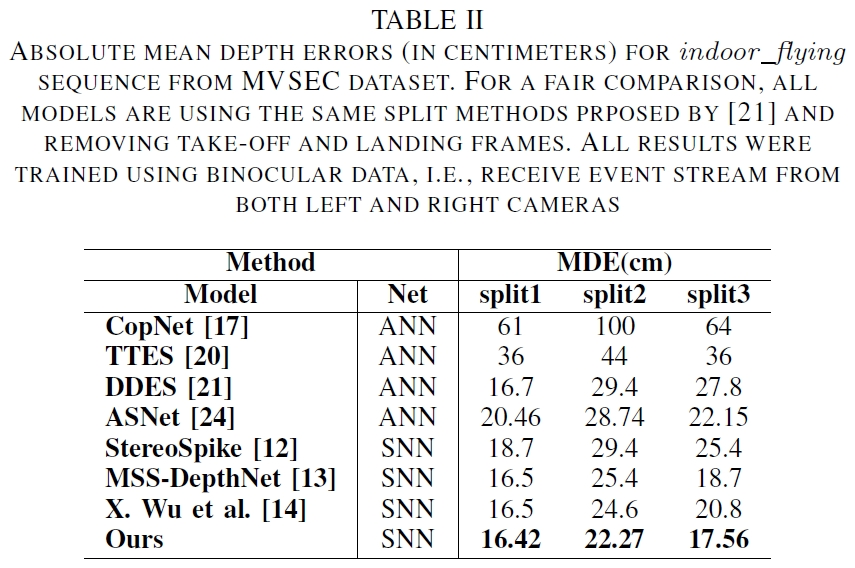

# SEDS: Stereo Event-based Depth Estimation with Spiking Neural Network
Tengfei Lu, Zhongli Wang, 

#### Videos [Processing]

<!-- #### [Project Page](https://16lemoing.github.io/dot) | [Paper](https://arxiv.org/abs/2312.00786) | [Video](https://www.youtube.com/watch?v=H0Rvq0OL87Y) | [BibTeX](#citation) -->

<!-- 

 -->

Depth estimation is a fundamental task in computer vision with wide-ranging applications in robotics, virtual reality (VR), and beyond. Event cameras have recently garnered significant attention due to their unique advantages, including high temporal resolution, low latency, and low power consumption. Moreover, spiking neural networks (SNNs), inspired by biological neural dynamics, feature event-driven processing capabilities, making them particularly well-suited for handling event-based data. Leveraging SNNs for depth estimation with stereo event cameras, mimicking biological vision, represents an exciting and promising research direction.
In this work, we propose a novel one-step spiking neural network (SNN) for dense depth estimation from stereo sparse event streams. The method extracts and decodes stereo event features using a U-Net architecture combined with a multi-head prediction design and achieves depth prediction through one step forward. It addresses the challenge of high-precision stereo matching by harnessing the high temporal resolution of event data. Key innovations include an event representation optimized for efficient SNN excitation transfer and a correlation module that effectively captures the spatio-temporal relationships between stereo event features.
The proposed model achieves superior performance compared to state-of-the-art ANN, SNN, and hybrid ANN-SNN approaches on indoor and outdoor sequences of the MVSEC dataset. Additionally, baseline comparisons highlight the dual advantages of accuracy improvement and energy consumption reduction, underscoring the model's practicality and efficiency.

<!-- > **We will release the source code of this work after the paper is accepted！**  -->
> **The source code is coming soon！** 

## Architecture

***Event Representation***. Red represents the positive polarity, while blue represents the negative polarity.

***The general discrete spiking neuron dynamic***

***Computation of correlation module in our work when disparity is 2 ($d=2$).***

## Experiment Results

<!-- > **Running on:** AMD R7 5800H with 16G RAM DDR4 3200MHz -->

### Efficiency

***Training-MDE***

***Firing Rate***

